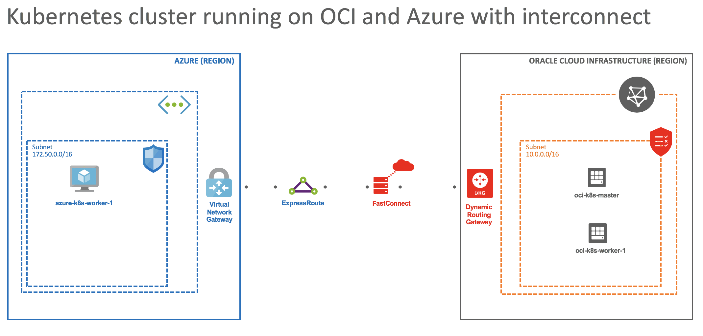

# Deploying a cross-cloud, GPU enabled Kubernetes cluster running on Oracle Cloud Infrastructure and Microsoft Azure using the interconnect

## Solution Overview

Oracle and Microsoft have built a dedicated, high-throughput, low-latency, private network connection between Azure and Oracle Cloud Infrastructure data centers. Customers can use the connection to securely transfer data at a high enough rate for offline handoffs and to support the performance required for primary applications that span the two clouds. Customers can access the connection by using either Oracle FastConnect or Microsoft ExpressRoute, and they don’t need to deal with configuration details or third-party carriers.

The connection is currently available only in these areas:

- Between the Oracle Cloud Infrastructure location in the US East (Ashburn) region and the Azure Washington DC (East US) location.

- Between the Oracle Cloud Infrastructure location in the UK South (London) region and the Azure London (UK South) location.

**IMPORTANT:** This cross-cloud capability is currently in preview in Azure. To establish low latency connectivity between Azure and OCI, your Azure subscription must first be enabled for this capability.

You must enroll in the preview by completing this short [survey form](https://forms.office.com/Pages/ResponsePage.aspx?id=v4j5cvGGr0GRqy180BHbRyzVVsi364tClw522rL9tkpUMVFGVVFWRlhMNUlRQTVWSTEzT0dXMlRUTyQlQCN0PWcu).

You will receive an email back once your subscription has been enrolled. You aren't able to use the capability until you receive a confirmation email. You may also contact your Microsoft representative to be enabled for this preview. Access to the preview capability is subject to availability and restricted by Microsoft in its sole discretion. Completion of the survey does not guarantee access.

This guide will walk you through deploying a cross-cloud Kubernetes cluster running on OCI and Azure using the interconnect. 

This guide also has instructions for deploying GPU-enabled virtual machines as Kubernetes workers, configuring them for Kubernetes, configuring the Kubernetes cluster for running MPI jobs, and setting up GPU monitoring.

## How is this different than using Kubernetes Federation (KubeFed)?
The cluster we are creating in this guide does not use [Kubernetes Federation (KubeFed)](https://github.com/kubernetes-sigs/kubefed). In a KubeFed scenario, you would have multiple separate Kubernetes clusters and then use KubeFed to coordinate the configurations of these multiple clusters from a single API. KubeFed project is currently alpha.

In this guide's scenario, you deploy a single Kubernetes cluster that spans across OCI and Azure. You can think of the interconnect as an extension of your network. It gives you a dedicated virtual circuit between OCI and Azure. So, you are able to deploy a Kubernetes cluster (or any other cluster) by following the regular steps you would follow when you were deploying a Kubernetes cluster on a single cloud or on-premises. And after deployment, you will be managing a single cluster.

## Why would you need a cross-cloud Kubernetes cluster?
There are several benefits of adopting a multi-cloud strategy. For this guide specifically, which deploys a GPU-enabled Kubernetes cluster for HPC workloads using the OCI/Azure interconnect, we can think about three main benefits:

#### 1. Optimized ROI/Resource Utilization
Many of our customers use multiple clouds. One of the main pain points they have is optimizing the utilization of the resources they consume. Using a cross-cloud cluster opens the door to selectively run workloads across OCI and Azure depending on your requirements. It's really easy to tell Kubernetes how you want the job to be run.

For example, you can tell Kubernetes "I need this MPI job to run only on Kubernetes nodes that have NVIDIA Tesla V100 GPUs" or "I need to run this job in the nodes that are in our development namespace and located in the UK".

#### 2. Security
The interconnect gives you a dedicated virtual circuit between OCI and Azure. The traffic does not go through the internet. You can even deploy a private Kubernetes cluster with nodes that have no public IPs.

#### 3. High Availability/Disaster Recovery
Your cluster will be running on OCI and Azure. Even in an event of a provider scale issue, your cluster would still be accessible. For simplicity, this guide does not setup an HA Kubernetes cluster. You can check [this link](https://kubernetes.io/docs/setup/production-environment/tools/kubeadm/high-availability/) for deploying a highly available Kubernetes cluster.

## Scope of this guide
The environment consists of the following resources. You can deploy virtual machines with different configurations (e.g. VMs that have multiple GPUs) depending on your needs.

- 1 [FastConnect](https://cloud.oracle.com/en_US/fastconnect) circuit on Oracle Cloud Infrastructure
- 1 [ExpressRoute](https://azure.microsoft.com/en-us/services/expressroute/) circuit on Microsoft Azure
- 1 [VM.Standard2.4](https://docs.cloud.oracle.com/iaas/Content/Compute/References/computeshapes.htm#virtualmachines) virtual machine running on OCI as the Kubernetes master
- 1 [VM.GPU3.1](https://docs.cloud.oracle.com/iaas/Content/Compute/References/computeshapes.htm#virtualmachines) virtual machine running on OCI as a Kubernetes worker for GPU workloads
- 1 [Standard NC6](https://docs.microsoft.com/en-us/azure/virtual-machines/windows/sizes-gpu#nc-series) virtual machine running on Microsoft Azure as a Kubernetes worker for GPU workloads.

| Cloud Provider | VM name            | VM shape (size) | Region            |
| -------------- | ------------------ | --------------- | ----------------- |
| OCI            | oci-k8s-master     | VM.Standard2.4  | US East (Ashburn) |
| OCI            | oci-k8s-worker-1   | VM.GPU3.1       | US East (Ashburn) |
| Azure          | azure-k8s-worker-1 | Standard NC6    | East US           |

## Step by step instructions for deploying a GPU enabled cross-cloud Kubernetes cluster running on Oracle Cloud Infrastructure and Microsoft Azure

### Step 1. [Configuring network](./docs/network-setup.md)
### Step 2. [Deploying the virtual machines](./docs/vm-deployment.md)
### Step 3. [Configuring the virtual machines](./docs/vm-setup.md)
### Step 4. [Deploying a Kubernetes cluster](./docs/kubernetes-setup.md)
### Step 5. [Deploying Kubeflow](./docs/kubeflow-setup.md)
### Step 6. [Deploying the Kubeflow MPI Operator and creating a Tensorflow MPI job](./docs/mpi-setup.md)
### Step 7. [Monitoring GPUs with Prometheus and Grafana](./docs/monitoring-setup.md)