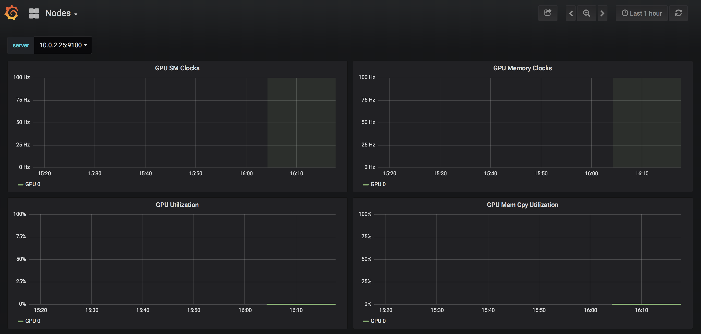

# Step 7: Monitoring GPUs with Prometheus and Grafana

We will use [Prometheus](https://github.com/coreos/kube-prometheus) and [Grafana](https://github.com/grafana/grafana) for monitoring our Kubernetes cluster with GPUs.

Firstly, we need to deploy [Helm](https://helm.sh/) in our cluster. Helm is the package manager for Kubernetes. Helm helps you manage Kubernetes applications — Helm Charts help you define, install, and upgrade even the most complex Kubernetes application.

1. Switch to your `master` node and run the following commands to create a service account named `tiller` for Helm:
```sh
kubectl create serviceaccount tiller --namespace kube-system
```

2. Grant necessary permissions to the `tiller` account:
```sh
kubectl create clusterrolebinding tiller-cluster-rule --clusterrole=cluster-admin --serviceaccount=kube-system:tiller
```

3. Install Helm by running the following commands:
   
```console
curl https://raw.githubusercontent.com/helm/helm/master/scripts/get-helm-3 > get_helm.sh
```

```console
chmod 700 get_helm.sh
```

```console
./get_helm.sh
```

4. Initialize Helm:

```console   
helm init --service-account tiller --wait
```

5. We need to [label](https://kubernetes.io/docs/concepts/overview/working-with-objects/labels/) our nodes, so that our monitoring solution knows where to look at for GPU nodes:

```sh
for node in $(kubectl get node --no-headers -o custom-columns=NAME:.metadata.name,GPU:.status.allocatable.nvidia\\.com\\/gpu | grep -v none | awk '{print $1}') ; do
    kubectl label nodes ${node} hardware-type=NVIDIAGPU --overwrite >/dev/null
done
```

6. Install Helm charts:

```console
helm repo add gpu-helm-charts https://nvidia.github.io/gpu-monitoring-tools/helm-charts
```

```console
helm repo update
```

```console
helm install gpu-helm-charts/prometheus-operator --name prometheus-operator --namespace monitoring
```

```console
helm install gpu-helm-charts/kube-prometheus --name kube-prometheus --namespace monitoring --set grafana.service.type=NodePort
```

7. Get the port of the Grafana service:

```console
kubectl get -o jsonpath='{.spec.ports[0].nodePort}{"\n"}' services kube-prometheus-grafana -n monitoring
```

You should see something similar to this:

```console
$ kubectl get -o jsonpath='{.spec.ports[0].nodePort}{"\n"}' services kube-prometheus-grafana -n monitoring

30902
```

8. Open a browser and go to `https://<your master node's external IP>:<port from previous step>`.

Example: `http://135.144.124.251:30902`

9.  In the Grafana homepage, click on **Home** in the upper left side and select **Nodes**.
    
10. You should see the metrics for your GPUs.


