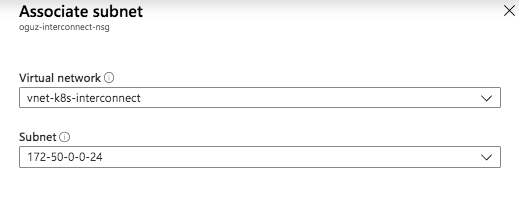
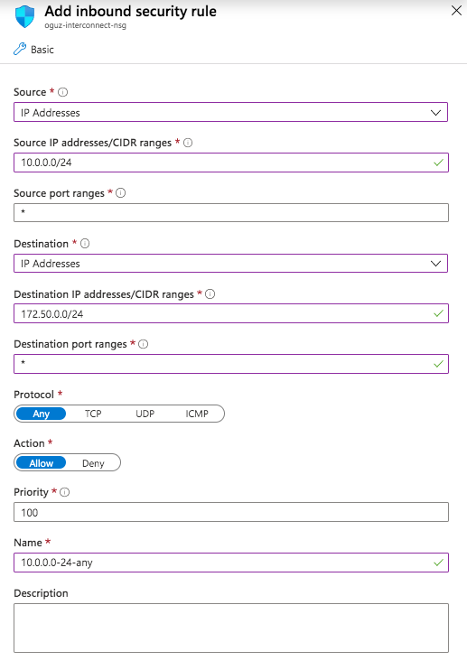
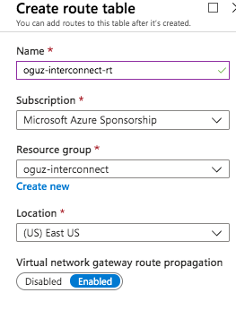

# Step 1: Configuring network
As a reminder, here is a table that lists the comparable networking components involved in each side of the connection.

# Prerequisite configuration

## Configuration on Azure

### 1. Create an Azure Virtual Network (VNet)
In the Azure Portal, go to **Create a resource > Networking > Virtual network**.

### 2. Create a Virtual Network Gateway
In the search box in Azure portal, search for **virtual network gateways** and click **Add**.

It might take up to 45 minutes for the Azure Virtual Network Gateway to be created. Wait until it's successfully created.

## Configuration on Oracle Cloud Infrastructure

### 1. Create a Virtual Cloud Network (VCN)
In the OCI console, navigate to **Menu > Networking > Virtual Cloud Networking > Create a Virtual Cloud Network**

### 2. Create a Dynamic Routing Gateway (DRG)
You can think of a DRG as a virtual router that provides a path for private traffic (that is, traffic that uses private IPv4 addresses) between your VCN and networks outside the VCN

In the OCI console, **Menu > Networking > Virtual Cloud Networking > Create Dynamic Routing Gateway**

### 3. Attach Dynamic Routing Gateway (DRG) to VCN
Now we need to attach the DRG to our VCN.

Go to **Menu > Networking > Virtual Cloud Networking > Virtual Cloud Network Details > Dynamic Routing Gateways**

# Creating the interconnection between OCI and Azure

After the prerequisites are completed, now you can create the interconnection between OCI and Azure.

### 1. Setup Azure ExpressRoute

In the Azure portal, click on **Create a resource**, search for **ExpressRoute**, and click **Create**.

After the ExpressRoute circuit is created, make a not of the **Service Key**. You will need it in later steps.

### 2. Setup Oracle Cloud Infrastructure FastConnect
Go to **Menu > Networking > FastConnect > Create Connection** and select **Use Oracle Provider**. Then select **Microsoft Azure: ExpressRoute** from the list.

Select **Private Virtual Circuit**, select the dynamic routing gateway you created in previous steps and enter the service key copied from Azure in the **Provider Service Key** field.

The interconnect uses BGP dynamic routing so we need to provide 2 primary and 2 secondary BGP IPs. Change the IPs if you need to.

Customer Primary BGP IPv4 Address: 192.168.0.2/30
Oracle Primary BGP IPv4 Address: 192.168.0.1/30
Customer Secondary BGP IPv4 Address: 192.168.0.6/30
Oracle Secondary BGP IPv4 Address: 192.168.0.5/30

Click **Create**. Wait until the **Lifecycle State** becomes *Provisioned* and **BGP State** becomes *Up*.

### 3. Link Azure VNet to Azure ExpressRoute

Switch to Azure portal. Go to your **Virtual Network Gateway > Connections** and select **Add**.

### 4. Associate Network Security groups and Route table to Azure VNet
In Azure Portal, select **Create a resource > Network Security Group** and select **Create**.

Select the newly created network security group from the dashboard, select **Subnets** and **Associate**.

Navigate to the newly created network security group from the dashboard, select **Inbound Security Rules** then click **Add**.

We are allowing all traffic coming from the OCI subnet. You may limit the list of open ports. Check [this link](https://kubernetes.io/docs/setup/production-environment/tools/kubeadm/install-kubeadm/#check-required-ports) for the list of required ports for Kubernetes.

Now let's create a Route Table. Select **Create a resource > Route Table** and select **Create**.

Once the new route table is created, associate the route table with the VNet. Go to your Route Table, select **Subnets**, click **Associate**. Then select the Vnet and subnet you created earlier.

### 5. Configure OCI VCN Security Lists and Route Table

Switch to OCI console and go to **Virtual Cloud Network > Security Lists > Default Security List > Add Ingress Rule** 

Once again, we are allowing all traffic coming from the Azure subnet. You may limit the list of open ports. Check [this link](https://kubernetes.io/docs/setup/production-environment/tools/kubeadm/install-kubeadm/#check-required-ports) for the list of required ports for Kubernetes.

Navigate **Menu > Virtual Cloud Networks > Your Virtual Cloud Network > Route Tables > Default Route table > Add Route Rules** in the OCI console.

# Next Step

After you complete setting up the network, continue to [Step 2: Deploying the virtual machines](../docs/vm-deployment.md).